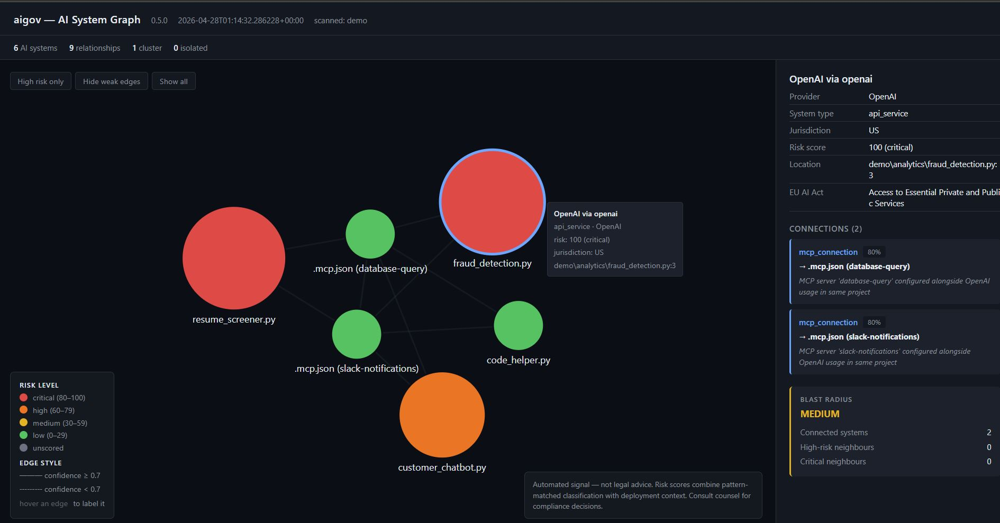
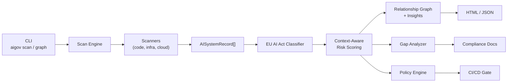

# aigov

**AI governance and risk analysis CLI — discover, classify, score, and visualise AI systems across your codebase and infrastructure.**

---

## tl;dr

aigov is an experimental AI governance and risk analysis CLI that discovers AI systems across your codebase, cloud infrastructure, and developer tools — classifies them against the EU AI Act, computes context-aware risk scores, and visualizes relationships via an evidence-backed graph.

> **Disclaimer:** aigov classifications and risk scores are automated signals based on pattern matching. They are **not legal advice**. Consult qualified legal counsel for compliance decisions.

---

## Status

Alpha — heuristic-based detection and context inference. Actively developed. Feedback welcome.

---

## What this is

A discovery and prioritization tool for AI systems — finds what AI you're running, estimates risk, and visualizes relationships.

## What this is not

- Not a full compliance solution — use alongside your GRC platform
- Not runtime enforcement — static analysis only
- Not legal advice — consult counsel for compliance decisions
- Not a replacement for manual review — a starting point for governance

---

## What problem are we solving?

The EU AI Act's full enforcement deadline is **2 August 2026**. Every organisation deploying AI in or selling into the EU must maintain a documented inventory of its AI systems — yet most engineering teams have no idea how many AI integrations actually live in their codebases. Studies show 80%+ of knowledge workers use AI tools without formal approval, creating pervasive "shadow AI" that nobody has inventoried or risk-assessed. No open-source tool existed to automatically discover and inventory AI usage the way `trivy` or `grype` handle CVEs. aigov fills that gap — run one command, get a full AI inventory with EU AI Act risk classifications, context-aware risk scores, and a visual map of how your AI systems relate.

---

## Quick Start

```bash
pip install aigov
aigov scan . --classify --with-risk
aigov graph . --out-file graph.html
```

The first command scans the current directory, classifies findings against the EU AI Act, and computes a 0–100 risk score per system. The second renders an interactive, self-contained HTML graph you can open by double-clicking.

---

## Example Output



The AI System Graph shows your AI landscape at a glance — node size reflects risk score, color indicates risk level (red = critical, orange = high, green = low), edges show evidence-backed relationships, and the side panel reveals blast radius and connection details. Generate it with `aigov graph . --out-file graph.html`.

A summary bar at the top of the page reports cluster count, isolated nodes (potential shadow AI), and the system with the largest blast radius. Click any node to see its risk drivers, the recommendations for remediation, and the evidence behind every relationship it participates in. Hover any edge to see *why* the two systems are linked — shared `.env`, MCP server in same project, two `.py` files in the same package, and so on.

---

## How It Works

- **Detects AI usage via static analysis** — scans Python imports, API keys, MCP configs, Dockerfiles, Terraform, Kubernetes manifests, and AWS cloud APIs to build an inventory of every AI system referenced in your repository.
- **Enriches context** — infers each system's deployment environment (production / staging / development / test), exposure (public API / internal service / batch / unknown), data sensitivity (PII, financial, health, auth credentials), and interaction type (real-time user-facing, batch / cron, internal tooling).
- **Computes risk scores (0–100)** — deterministic and explainable. The score combines the EU AI Act classification baseline with the four context modifiers above, clamped to `[0, 100]` and banded into critical / high / medium / low. Every score ships with its driver list so you can see exactly *why* it landed where it did.
- **Builds an evidence-backed relationship graph** — edges only exist when there is concrete evidence: shared config files, an MCP server in the same project as an AI service, two `.py` files in the same package, two AWS resources in the same Terraform module. Each edge carries a confidence and the evidence sentence(s) that produced it.

---

## Scanners

| Scanner | What it finds |
|---------|--------------|
| `code.python_imports` | AI/ML library imports in Python source — OpenAI, Anthropic, LangChain, HuggingFace, DeepSeek, and 20+ others mapped to provider and jurisdiction |
| `code.api_keys` | Hardcoded AI service API keys in source, config, and env files — values are never stored, only redacted previews |
| `config.mcp_servers` | MCP server configs from Claude Desktop, Cursor, Windsurf, VS Code, and project-level `.mcp.json` files |
| `cloud.aws` | AWS Bedrock foundation models, SageMaker endpoints, Comprehend, Rekognition, and Lex resources (`pip install aigov[aws]`) |
| `infra.docker` | Detects AI base images, model files, and ML frameworks in Dockerfiles and docker-compose |
| `infra.terraform` | Discovers AI service provisioning in Terraform/OpenTofu across AWS, Azure, and GCP |
| `infra.kubernetes` | Finds GPU workloads, AI containers, and ML platform CRDs in Kubernetes manifests |

All findings include `origin_jurisdiction` (ISO 3166-1) for geography-based policy filtering.

---

## Classification Frameworks

| Framework | Articles covered | Status |
|-----------|-----------------|--------|
| EU AI Act | Article 5 (prohibited practices), Annex III (high-risk categories), Article 50 (transparency obligations) | **Available** |
| Colorado AI Act (SB 205) | High-risk AI system obligations for Colorado residents | Roadmap |
| NIST AI RMF | Govern, Map, Measure, Manage functions | Roadmap |

---

## Risk Scoring

`aigov scan --with-risk` produces a deterministic 0–100 risk score per finding, combining the EU AI Act classification with deployment context (environment, exposure, data sensitivity, interaction type). Scores are pattern-matching signals, not legal determinations — see [docs/scoring-model.md](docs/scoring-model.md) for the base scores, modifier tables, banding, confidence calculation, and a worked example.

---

## Limitations

aigov is an alpha tool with concrete trade-offs. Read these before relying on it:

- **Detection is heuristic-based.** Static analysis cannot catch all AI usage patterns — dynamically loaded models, browser-based AI tools, AI invoked from generated code, and AI behind opaque service boundaries will not be found.
- **Relationships are inferred, not proven runtime dependencies.** Every edge in the graph is an evidence-backed signal — "both files import openai", "both AI services share a directory with an .env" — not a guaranteed runtime call. Use the evidence sentences and confidence values as triage signals, not facts.
- **Risk scores are automated signals, not legal determinations.** Pattern matching makes no commitment about EU AI Act compliance, fitness for any regulatory regime, or fitness for any legal purpose. Consult qualified legal counsel for compliance decisions.
- **Currently scans Python files only.** JavaScript / TypeScript, Java, and Go scanners are on the roadmap. Until then, repos written in those languages are blind spots.
- **Best used as a discovery and prioritization tool, not a compliance certificate.** aigov surfaces AI systems for human review — it does not replace legal review, threat modelling, or formal conformity assessment.

---

## CI/CD Integration

Add aigov to your workflow to block deployments if prohibited AI systems are detected:

```yaml
steps:
  - uses: actions/checkout@v4
  - uses: abhaykshir/aigov@v0.5.0
    with:
      scan-paths: "."
      classify: "true"
      fail-on: "prohibited,high_risk"
```

The action fails the step on any finding at or above the configured risk level. See [`action.yml`](action.yml) for all inputs and outputs.

---

## Continuous Monitoring

aigov ships three tools for ongoing AI governance — not just one-shot scans.

**Git hooks** — block commits that introduce prohibited AI systems:

```bash
aigov hooks install
# pre-commit hook now runs aigov scan --classify on every commit
# PROHIBITED systems block the commit; HIGH_RISK systems warn
```

Approve known systems so they don't trigger warnings:

```yaml
# .aigov-allowlist.yaml
approved:
  - id: "abc123def456"
    reason: "Approved by AI governance board 2026-01-15"
  - name_pattern: "internal-chatbot-*"
    reason: "Internal tools approved under policy AI-2026-003"
```

**Drift detection** — detect new AI systems since your last approved baseline:

```bash
# Save current state as the approved baseline
aigov baseline save

# In CI: compare against baseline and fail if new HIGH_RISK or PROHIBITED systems appear
aigov baseline diff --fail-on-drift
```

**Example CI workflow** combining all three:

```yaml
- uses: actions/checkout@v4
- uses: abhaykshir/aigov@v0.5.0
  with:
    scan-paths: "."
    classify: "true"
    fail-on: "prohibited,high_risk"
- name: Drift check
  run: aigov baseline diff --fail-on-drift --baseline .aigov-baseline.json
```

---

## Custom Rules

Layer your organisation's own governance policies on top of EU AI Act classification. Create `.aigov-rules.yaml` in your repo root — aigov auto-discovers it on every `scan` or `classify` run.

```yaml
# .aigov-rules.yaml
custom_rules:
  - name: "Block restricted jurisdictions"
    description: "Company policy prohibits AI from certain jurisdictions"
    match:
      jurisdiction: ["CN", "RU"]
    action:
      risk_level: prohibited
      reason: "Company policy restricts AI from this jurisdiction"

  - name: "Flag patient data AI"
    description: "AI processing patient data requires HIPAA review"
    match:
      keywords: ["patient", "diagnosis", "clinical", "health record"]
    action:
      risk_level: high_risk
      reason: "HIPAA review required per internal policy AI-2026-001"

  - name: "Register LLM usage"
    description: "All LLM API services need governance board approval"
    match:
      providers: ["OpenAI", "Anthropic", "Google", "Mistral"]
    action:
      risk_level: limited_risk
      reason: "LLM usage requires governance board registration"
```

Three match types can be combined (AND logic across types, OR within each list):

| Match type | Field checked |
|------------|--------------|
| `keywords` | Record name, description, and source location (case-insensitive) |
| `jurisdiction` | `origin_jurisdiction` tag (ISO 3166-1 country code) |
| `providers` | Provider name (case-insensitive) |

Custom rules **only escalate** — they never downgrade a regulatory classification already set by the EU AI Act classifier. Use `--rules` to specify a non-default path:

```bash
aigov scan . --classify --rules ./policies/ai-rules.yaml
```

---

## Output Formats

```bash
# JSON — full schema with classification, risk fields, drivers, and tags
aigov scan . --classify --with-risk --output json --out-file inventory.json

# Markdown — human-readable report with risk scoring section
aigov scan . --classify --output markdown --out-file AIINVENTORY.md

# CSV — flat schema for Excel, CISO Assistant, ServiceNow, or any GRC tool
aigov scan . --classify --output csv --out-file inventory.csv

# SARIF — for the GitHub Security tab
aigov scan . --classify --output sarif --out-file inventory.sarif
```

Or convert a saved scan result post-hoc:

```bash
aigov export inventory.json --format csv --out-file inventory.csv
aigov export inventory.json --format sarif --out-file inventory.sarif
```

---

## Architecture



---

## Security

See [SECURITY.md](SECURITY.md) for the full policy.

- **No secrets stored** — API keys detected but never recorded; only type, location, and a 4-char redacted preview are kept
- **Read-only** — never modifies source files, cloud resources, or system configurations
- **Local processing** — no telemetry, no external API calls, no data leaves your machine
- **Minimal dependencies** — small, auditable dependency tree from trusted sources with pinned versions

---

## Tests

1006 tests passing across the scanner, classifier, risk-scoring, policy, explainability, graph, and CI subsystems. Run them locally with `pytest` from the repo root.

---

## Roadmap

> aigov is in active alpha development. Features are functional but evolving. Feedback and contributions welcome.

| Phase | Status | Description |
|-------|--------|-------------|
| 1 — Discovery | Shipped (alpha) | Python imports, API keys, MCP server scanners |
| 2 — Risk Classification | Shipped (alpha) | EU AI Act Article 5, Annex III, Article 50 |
| 3 — Gap Analysis | Shipped (alpha) | Compliance gap analyzer — missing controls per finding |
| 4 — Documentation Generator | Shipped (alpha) | Draft conformity declarations and DPIA stubs |
| 5 — Cloud & Infra Scanners | Shipped (alpha) | AWS Bedrock, SageMaker, Comprehend, Rekognition, Lex; Docker, Terraform, Kubernetes |
| 6 — CI/CD Integration | Shipped (alpha) | GitHub Actions reusable action and `aigov-check` CLI |
| 7 — Continuous Monitoring | Shipped (alpha) | Git hooks, allowlist, and baseline drift detection |
| 8 — Custom Rules & GRC Export | Shipped (alpha) | Org-specific rules engine; CSV / JSON / SARIF export |
| 9 — Context-Aware Risk Scoring | Shipped (alpha) | 0–100 deterministic scores with environment / exposure / sensitivity / interaction modifiers |
| 10 — Policy Enforcement & Explainability | Shipped (alpha) | YAML policy engine, unified `aigov-check` flags, actionable per-finding recommendations |
| 11 — AI System Graph | Shipped (alpha) | Evidence-backed relationship graph with blast radius, cluster detection, and isolated-node alerts |
| 12 — Additional Frameworks | 📋 Planned | Colorado AI Act SB 205, NIST AI RMF |
| 13 — JS/TS, Java, Go Scanners | 📋 Planned | Extend static analysis beyond Python |
| 14 — Dashboard | 📋 Planned | Web UI for inventory visualization and compliance tracking |

---

## Contributing

Contributions are welcome — especially new scanners, classification rules, and framework mappings. See [CONTRIBUTING.md](CONTRIBUTING.md) to get started.

---

## Governance

This project is maintained by [Abhay K](https://github.com/abhaykshir). See [GOVERNANCE.md](GOVERNANCE.md) for the decision process and regulatory accuracy policy.

---

## Performance

Designed for small to medium codebases (up to ~50 repos). Large monorepos may require scanner filtering via `--scanners` flag.

---

## License

Apache 2.0 — see [LICENSE](LICENSE).
