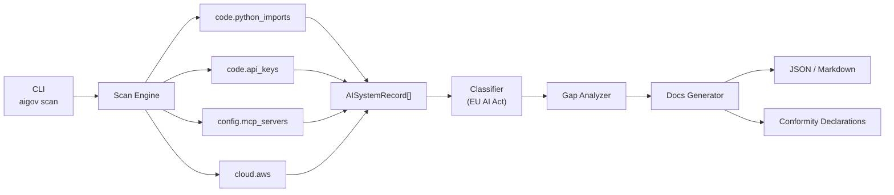

# aigov

**AI Governance-as-Code CLI — discover, classify, and govern AI systems across your infrastructure.**

---

## tl;dr

aigov scans your codebase, CI pipeline, and cloud infrastructure to automatically discover every AI system in use, classify each one against the EU AI Act, and flag the compliance gaps your team needs to close. It works like `trivy` for CVEs — but for AI governance risk. Built for engineering teams who must achieve EU AI Act compliance before the August 2026 enforcement deadline.

---

## What problem are we solving?

The EU AI Act's full enforcement deadline is **2 August 2026**. Every organisation deploying AI in or selling into the EU must maintain a documented inventory of its AI systems — yet most engineering teams have no idea how many AI integrations actually live in their codebases. Studies show 80%+ of knowledge workers use AI tools without formal approval, creating pervasive "shadow AI" that nobody has inventoried or risk-assessed. No open-source tool existed to automatically discover and inventory AI usage the way `trivy` or `grype` handle CVEs. aigov fills that gap — run one command, get a full AI inventory with EU AI Act risk classifications.

---

## What does aigov do?

aigov runs a four-stage pipeline: **discover** AI systems from imports, API keys, MCP configs, and cloud resources; **classify** each finding against the EU AI Act risk tiers; **gap-analyze** what compliance controls are missing; and **generate** draft documentation and conformity declarations. The full pipeline runs in a single command:

```bash
aigov scan . --classify --gaps --docs
```

---

## Quick Start

```bash
pip install aigov
aigov scan . --classify
```

Example output:

```
                        AI Systems Found (6)
┌──────────────────────────────────────────────────────────────────────┐
│  #  Name                   Type         Provider     Risk            │
├──────────────────────────────────────────────────────────────────────┤
│  1  openai (gpt-4o)        api_service  OpenAI       ⚠  limited     │
│  2  anthropic (claude-3)   api_service  Anthropic    ⚠  limited     │
│  3  rekognition             model        AWS          🔴 high_risk   │
│  4  filesystem              mcp_server   —            ✓  minimal     │
│  5  langchain               agent        LangChain    ⚠  limited     │
│  6  deepseek                api_service  DeepSeek     ⚠  limited     │
└──────────────────────────────────────────────────────────────────────┘

Found 6 AI systems · 1 high-risk · 3 limited-risk · 2 minimal-risk
```

Export to JSON, Markdown, or CSV for compliance evidence and GRC platform import:

```bash
aigov scan . --output json --out-file inventory.json
aigov scan . --output markdown --out-file AIINVENTORY.md
aigov scan . --classify --output csv --out-file inventory.csv
```

Export a saved scan result directly to CSV or flat JSON for Excel, CISO Assistant, ServiceNow, or any GRC tool:

```bash
aigov export inventory.json --format csv --out-file inventory.csv
aigov export inventory.json --format json --out-file inventory-flat.json
```

---

## Scanners

| Scanner | What it finds |
|---------|--------------|
| `code.python_imports` | AI/ML library imports in Python source — OpenAI, Anthropic, LangChain, HuggingFace, DeepSeek, and 20+ others mapped to provider and jurisdiction |
| `code.api_keys` | Hardcoded AI service API keys in source, config, and env files — values are never stored, only redacted previews |
| `config.mcp_servers` | MCP server configs from Claude Desktop, Cursor, Windsurf, VS Code, and project-level `.mcp.json` files |
| `cloud.aws` | AWS Bedrock foundation models, SageMaker endpoints, Comprehend, Rekognition, and Lex resources (`pip install aigov[aws]`) |
| `infra.docker` | Detects AI base images, model files, and ML frameworks in Dockerfiles and docker-compose |
| `infra.terraform` | Discovers AI service provisioning in Terraform/OpenTofu across AWS, Azure, and GCP |
| `infra.kubernetes` | Finds GPU workloads, AI containers, and ML platform CRDs in Kubernetes manifests |

All findings include `origin_jurisdiction` (ISO 3166-1) for geography-based policy filtering.

---

## Classification Frameworks

| Framework | Articles covered | Status |
|-----------|-----------------|--------|
| EU AI Act | Article 5 (prohibited practices), Annex III (high-risk categories), Article 50 (transparency obligations) | **Available** |
| Colorado AI Act (SB 205) | High-risk AI system obligations for Colorado residents | Roadmap |
| NIST AI RMF | Govern, Map, Measure, Manage functions | Roadmap |

---

## CI/CD Integration

Add aigov to your workflow to block deployments if prohibited AI systems are detected:

```yaml
steps:
  - uses: actions/checkout@v4
  - uses: abhaykshir/aigov@v1
    with:
      scan-paths: "."
      classify: "true"
      fail-on: "prohibited,high_risk"
```

The action fails the step on any finding at or above the configured risk level. See [`action.yml`](action.yml) for all inputs and outputs.

---

## Continuous Monitoring

aigov ships three tools for ongoing AI governance — not just one-shot scans.

**Git hooks** — block commits that introduce prohibited AI systems:

```bash
aigov hooks install
# pre-commit hook now runs aigov scan --classify on every commit
# PROHIBITED systems block the commit; HIGH_RISK systems warn
```

Approve known systems so they don't trigger warnings:

```yaml
# .aigov-allowlist.yaml
approved:
  - id: "abc123def456"
    reason: "Approved by AI governance board 2026-01-15"
  - name_pattern: "internal-chatbot-*"
    reason: "Internal tools approved under policy AI-2026-003"
```

**Drift detection** — detect new AI systems since your last approved baseline:

```bash
# Save current state as the approved baseline
aigov baseline save

# In CI: compare against baseline and fail if new HIGH_RISK or PROHIBITED systems appear
aigov baseline diff --fail-on-drift
```

**Example CI workflow** combining all three:

```yaml
- uses: actions/checkout@v4
- uses: abhaykshir/aigov@v1
  with:
    scan-paths: "."
    classify: "true"
    fail-on: "prohibited,high_risk"
- name: Drift check
  run: aigov baseline diff --fail-on-drift --baseline .aigov-baseline.json
```

---

## Custom Rules

Layer your organisation's own governance policies on top of EU AI Act classification. Create `.aigov-rules.yaml` in your repo root — aigov auto-discovers it on every `scan` or `classify` run.

```yaml
# .aigov-rules.yaml
custom_rules:
  - name: "Block restricted jurisdictions"
    description: "Company policy prohibits AI from certain jurisdictions"
    match:
      jurisdiction: ["CN", "RU"]
    action:
      risk_level: prohibited
      reason: "Company policy restricts AI from this jurisdiction"

  - name: "Flag patient data AI"
    description: "AI processing patient data requires HIPAA review"
    match:
      keywords: ["patient", "diagnosis", "clinical", "health record"]
    action:
      risk_level: high_risk
      reason: "HIPAA review required per internal policy AI-2026-001"

  - name: "Register LLM usage"
    description: "All LLM API services need governance board approval"
    match:
      providers: ["OpenAI", "Anthropic", "Google", "Mistral"]
    action:
      risk_level: limited_risk
      reason: "LLM usage requires governance board registration"
```

Three match types can be combined (AND logic across types, OR within each list):

| Match type | Field checked |
|------------|--------------|
| `keywords` | Record name, description, and source location (case-insensitive) |
| `jurisdiction` | `origin_jurisdiction` tag (ISO 3166-1 country code) |
| `providers` | Provider name (case-insensitive) |

Custom rules **only escalate** — they never downgrade a regulatory classification already set by the EU AI Act classifier. Use `--rules` to specify a non-default path:

```bash
aigov scan . --classify --rules ./policies/ai-rules.yaml
```

---

## Architecture



---

## Security

See [SECURITY.md](SECURITY.md) for the full policy.

- **No secrets stored** — API keys detected but never recorded; only type, location, and a 4-char redacted preview are kept
- **Read-only** — never modifies source files, cloud resources, or system configurations
- **Local processing** — no telemetry, no external API calls, no data leaves your machine
- **Minimal dependencies** — small, auditable dependency tree from trusted sources with pinned versions

---

## Roadmap

| Phase | Status | Description |
|-------|--------|-------------|
| 1 — Discovery | ✅ Done | Python imports, API keys, MCP server scanners |
| 2 — Risk Classification | ✅ Done | EU AI Act Article 5, Annex III, Article 50 |
| 3 — Gap Analysis | ✅ Done | Compliance gap analyzer — missing controls per finding |
| 4 — Documentation Generator | ✅ Done | Draft conformity declarations and DPIA stubs |
| 5 — Cloud Scanners | ✅ Done | AWS Bedrock, SageMaker, Comprehend, Rekognition, Lex |
| 6 — CI/CD Integration | ✅ Done | GitHub Actions reusable action and `aigov-check` CLI |
| 7 — Continuous Monitoring | ✅ Done | Git hooks, allowlist, and baseline drift detection |
| 8 — Custom Rules & GRC Export | ✅ Done | Org-specific rules engine; CSV/JSON export for GRC platforms |
| 9 — Additional Frameworks | 📋 Planned | Colorado AI Act SB 205, NIST AI RMF |
| 10 — More Scanners | 📋 Planned | JS/TS imports, Terraform AI resources, Docker image scanning |
| 11 — Dashboard | 📋 Planned | Web UI for inventory visualization and compliance tracking |

---

## Contributing

Contributions are welcome — especially new scanners, classification rules, and framework mappings. See [CONTRIBUTING.md](CONTRIBUTING.md) to get started.

---

## Governance

This project is maintained by [Abhay K](https://github.com/abhaykshir). See [GOVERNANCE.md](GOVERNANCE.md) for the decision process and regulatory accuracy policy.

---

## License

Apache 2.0 — see [LICENSE](LICENSE).
